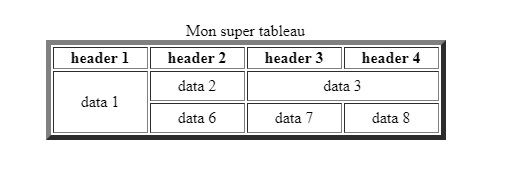

# Les tableaux et les boutons en HTML

## Les tableaux

Pour construire un tableau, il me faut avant tout une balise `<table></table>`. A l'intérieur de cette balise, je spécifie le nombre de lignes que comporte mon tableau à l'aide de `<tr></tr>`

```html
<table>
    <tr></tr>
    <tr></tr>
    <tr></tr>
</table>    
```

A l'intérieur de ces lignes, je peux placer des en-têtes (headers) avec `<th></th>` ou des données simples avec `<td></td>`.

```html
<table>
    <tr>
        <th></th> <!-- Pas obligatoire si on ne veut pas nommer nos lignes 1 et 2-->
        <th>header 1</th>
        <th>header 2</th>
    </tr>
    <tr>
        <th>Ligne 1</th> <!-- Pas obligatoire si on ne veut pas nommer nos lignes 1 et 2-->
        <td>data 1</td>
        <td>data 2</td>
    </tr>
    <tr>
        <th>Ligne 2</th> <!-- Pas obligatoire si on ne veut pas nommer nos lignes 1 et 2-->
        <td>data 3</td>
        <td>data 4</td>
    </tr>
</table>    
```

Pour le référencement et pour un code plus solide et lisible, je précise grâce aux balises `<thead></thead>`, `<tbody></tbody>` et `<tfoot></tfoot>` l'organisation de mon tableau.


```html
<table>
    <thead>
        <tr>
            <th>header 1</th>
            <th>header 2</th>
        </tr>
        </thead>
        <tbody>
        <tr>
            <td>data 1</td>
            <td>data 2</td>
        </tr>
        <tr>
            <td>data 3</td>
            <td>data 4</td>
        </tr>
    </tbody>
</table>
```

On peut rajouter un titre à son tableau grâce à la balise `<caption></caption>`  

Au niveau des attributs, on peut rajouter des attributs de style à notre tableau, mais on évitera de le faire si on utilise du CSS: 

>`border= taille_en_px` La taille en pixels des bordures.  
`width= taille_en_px` La longueur en pixels de notre tableau.  
`height= taille_en_px` La hauteur en pixels de notre tableau.  
`align= left, right ou center` L'alignement vertical des données.

Si on veut que l'une de nos données prenne plus d'une ligne ou colonne, on lui appliquera l'attribut `rowspan="nombre"` ou `colspan="nombre"`


*Exemple d'utilisation des différents attributs*

```html
<table border="5" align="center" width="400px" height="100px">
        <caption>Mon super tableau</caption> <!--titre du tableau-->
        <thead>
            <tr>
                <th>header 1</th>
                <th>header 2</th>
                <th>header 3</th>
                <th>header 4</th>
            </tr>
            </thead>
            <tbody align="center">
            <tr>
                <td rowspan="2">data 1</td> <!--la data prend 2 lignes-->
                <td>data 2</td>
                <td colspan="2">data 3</td> <!--la data prend 2 colonnes-->
            </tr>
            <tr>
                <td>data 6</td>
                <td>data 7</td>
                <td>data 8</td>
            </tr>
        </tbody>
    </table>
```




   

## Les boutons

Pour créer un bouton en HTML, j'utiliserai une balise `<button></button>`  
Il est cependant intéressant de spécifier le type de bouton, grâce à l'attribut `type`:
>- `<button type="button">`: Il s'agit d'un bouton classique. C'est le choix par défaut si le type n'est pas spécifié.
>- `<button type="submit">`: Utile au sein d'un formulaire, il envoie le formulaire.
>- `<button type="reset">` : Utile au sein d'un formulaire, il réinitialise les champs de ce formulaire.

Si on veut désactiver un bouton, on lui met l'attribut `disabled`.

**Attention: `<button>` est de type inline!**