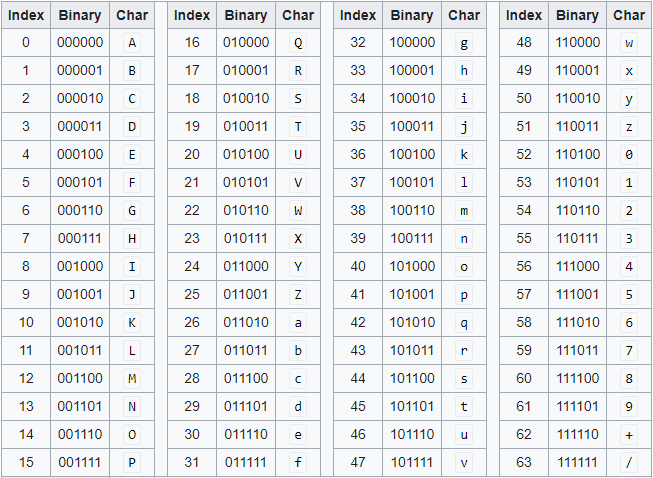

## Différences SGBDR et SGBD Non relationnel

>**SGBD** = Système de Gestion de Base de Données

- **SGBDR**
    - SQL
    - Structuré en tables
    - Ici on a une relation colonne/valeur
    - Une case = un type de valeur (chaine de caractères, nbr, blob...)
    - La base pourra avoir plusieurs tables dont la relation s'effectue par un système de clés (clé primaire et clé étrangère). La clé étrangère permet de relier une table vers notre enregistrement.
    - Plusieurs types de relation:
        - One to one (ex: un seul prof peut enseigner une seule matière.) 
            - Généralement on indique la clé étrangère des deux côtés dans ce cas
        - One to many 
            - la clé étrangère ne sera que dans le one
        - Many to many 
            - nécessite une table de liaison qui va faire la relation

- **SGBD Non-relationnel**
    - NoSQL
    - Non structuré
    - Fonctionne sur un système de clé/valeur
    - A ne pas utiliser pour des données qui peuvent être structurées (ex: données utilisateurs)
    - Permettent aussi de gérer une quantité de données énorme.

Il existe aussi des **BDD en colonne** (ex: Cassandra). L'inconvénient c'est qu'on ne peut pas trier les données facilement. Mais gros avantage pour les datalake ou datawarehouses qui permettent de stocker un grand nombre de données en attente de traitement.

Une même application peut tourner avec plusieurs SGBD qu'ils soient relationnels ou non.

>Le format/type `blob` est l'équivalent du byte mais pour les médias (vidéos, photos...)

>Format `Base64` : Le terme base64 vient à l'origine de l'encodage utilisé pour transférer certains contenus MIME. Les schémas d'encodage en base64 sont *principalement utilisés lorsqu'il s'agit d'enregistrer ou d'envoyer des données binaires* via un média qui a été conçu pour gérer du texte en ASCII.

  
*Tableau base64*

>Règle des 3 v :
>- **Volume** de données considérables à traiter
>- **Vélocité/Vitesse** de création, collecte et partage des données
>- **Variété** d’informations

Il s'agit d'une règle en BigData.