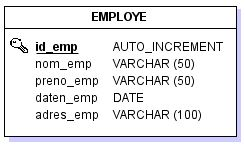

# Objectif  
Nous avons cerné l'information du système à informatiser et réalisé le dictionnaire des données.
A partir de celui-ci nous allons modéliser le système d'information, il y a trois niveaux de modélisation:

- Le niveau conceptuel, il s'agit du MCD (Modèle Conceptuel des Données)
- Le niveau logique, il s'agit du MLD (Modèle Logique des Données)
- Le niveau physique, il s'agit du MPD (Modèle Physique des Données)

## Niveau conceptuel (MCD)

Le MCD permet de représenter le système d'information indépendamment de son aspect informatique, il doit être compréhensible par tous: informaticiens, employés, secrétaires, personnel de direction, etc.

Pour ce faire la méthode Merise utilise 2 représentations:

- **l'entité**: elle regroupe l'information statique et durable.  
Par exemple, l’entité employe rassemble toutes les informations communes aux employés d'une entreprise  
*Une entité est représentée par un nom commun écrit en majuscules et au singulier.*  
Exemples: EMPLOYE, DIPLOME, COMMUNE, FOURNISSEUR, etc.
- **l'association**: elle matérialise la dynamique du système et donc les relations entre les entités.  
Par exemple, l'entité employe est en relation avec l'entité service de l'entreprise.  
*L'association (ou relation) est représentée par un verbe d'action ou d'éta à l'infinitif.*
Exemples: HABITER, LOUER, JOUER, CARACTERISER, etc.

### L'entité

Lorsque le dictionnaire des données est terminé on regroupe les données dans des ensembles cohérents: les **entités**.  
Par conventions ces entités sont symbolisées par des rectangles. Chaque entité porte un nom, qui l'identifie de manière unique. Ce nom sera obligatoirement un substantif en majuscules et au singulier.

>Une entité regroupe des informations de même nature, ces informations sont représentées par les attributs de l'entité.

Chaque attribut répond aux règles suivantes (voir normalisation):

- Un attribut ne peut en aucun cas être partagé par plusieurs entités ou associations (polysémie).
- Un attribut est une donnée élémentaire, ce qui exclut des données calculées ou déduites d'autres attributs.
- Une entité et ses attributs doivent être cohérents entre eux (ne traiter que d’un seul sujet).
- Un ou un ensemble d'attributs constituent la clé primaire de l'entité.

Afin d'éviter les synonymes et les polysème on fera suivre le nom de l'attribut par un suffixe de 4 caractères: l'underscore et les 3 premières lettres de l'entité auquel il appartient.

### L'association

On met les entités en relation au moyen d'une association.

>Une association (ou une relation) est un lien entre plusieurs entités.

L'association représente la dynamique du système, elle exprime l'activité du système d'information, elle est caractérisée par les cardinalités.

L'association est représentée par un ovale dont le titre est un verbe d'action ou d'état.

### La cardinalité

>La cardinalité d’une patte reliant une association et une entité précise le nombre de fois minimal et maximal d’interventions d’une occurence de l'entité avec l'association. La cardinalité minimale doit être inférieure ou égale à la cardinalité maximale.

Les seuls cardinalités admises sont donc :

- 1-1: une occurrence de l'entité participe minimum et maximum 1 fois à l'association
- 0-1: une occurrence de l'entité peut exister sans pour autant participer à la relation et ne participe jamais plus d'une fois
- 1-n: une occurrence de l'entité participe au moins une fois à l'association et peut participer sans limitation
- 0-n: une occurrence de l'entité peut exister sans pour autant participer à la relation et peut participer sans limitation

Une commune peut héberger aucun employé mais une commune peut héberger plusieurs employés.

Un employé ne peut avoir qu'un et un seul domicile (une résidence secondaire n'est pas le domicile d'une personne!)

Un employé travaille dans un service ou plusieurs services,la cardinalité 0 est impossible, cela voudrait dire qu'un employé n'a pas de service où travailler!

Un service peut occuper 1 ou plusieurs employés, la cardinalité 0 est impossible, cela voudrait dire qu'il est possible que personne ne travaille dans un service!

## Normaliser le MCD

>!!!Petit truc de la mort qui tue!!!
L'attribut d'une entité est toujours en relation [1-1 1-1] avec la clé.

**Première forme normale (1NF)**: Chaque cellule d'une table doit contenir une valeur unique et cette valeur doit être élémentaire.

**Deuxième forme normale (2NF)**: Chaque attribut de la table doit dépendre de la clé primaire au complet et non d'une partie de la clé.

**Troisième forme normale (3NF)**: Aucun attribut non-clé doit dépendre d'un autre attribut non-clé.

**Boyd-Codd**: tous les attributs non-clé ne sont pas source de dépendance fonctionnelle (DF) vers une partie de la clé

## Niveau logique (MLD)

Les entités mises en relation deviennent des **tables**.

**EMPLOYE**: id_emp, nom_emp, preno_emp, daten_emp, adres_emp
**COMMUNE**: id_com, nom_com, codep_com
**SERVICE**: id_ser, nom_ser

### Association (1-1)(1-n)

L'association disparaît, elle est matérialisée par la duplication de la clé côté (1-n) du côté (1-1).

**EMPLOYE**: id_emp, nom_emp, preno_emp, daten_emp,id_com

La clé dupliquée est appelée clé étrangère

### Association (1-n)(1-n)

L'association devient une table ayant comme clef primaire la concaténation des clefs primaires des 2 entités.

**TRAVAILLER**: id_emp, id_ser

Une table issue d'une association peut avoir des attributs au même titre que n'importe quelle autre table

### Au final, le MLD est le suivant:

**EMPLOYE**: id_emp, nom_emp, preno_emp, daten_emp,id_com  
**COMMUNE**: id_com, nom_com, codep_com  
**SERVICE**: id_ser, nom_ser  
**TRAVAILLER**: id_emp, id_ser

## Niveau physique (MPD)

Il s'agit de la représentation modélisée qui précède l'implémentation dans le SGBDR.

## Vocabulaire

Selon l'étape de l'analyse on utilise un vocabulaire particulier.

MCD      |Relation |	SGBD  |
|:------:|:-------:|:--------:|
|Entité	 |Relation |	Table |
|Association |	Relation |	Table |
|Identifiant |	Clé primaire |	Clé primaire|
| 	|Clé étrangère	|Clé étrangère|
|Attribut, propriété|	Attribut|	Champs, colonne|
|Occurence, instance|	Occurence|	Occurence, enregistrement|