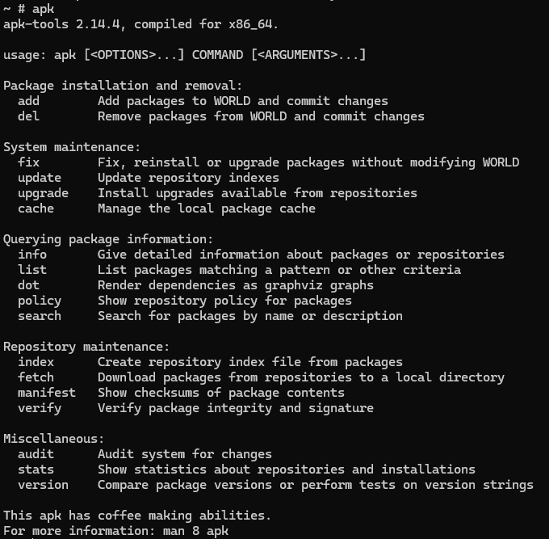

# Docker


[Installation](https://www.docker.com/products/docker-desktop/)  
[DocumentationDocker](https://docs.docker.com/reference/cli/docker/)

## Bases

Va servir lors du déploiement d'applications et va répondre également à une problématique que les devs ont: uniformiser un environnement de développement, avec une base unique pour faire tourner un projet. Il résout la problématique du fameux "ça marche sur mon poste".

Il peut être installé sur tous types de distribution : Windows, Linuw, MacOS

## Différences conteneur et VM

Les conteneurs et les machines virtuelles sont des technologies qui rendent vos applications indépendantes des ressources de votre infrastructure informatique. Un conteneur est un paquet de code logiciel contenant le code d'une application, ses bibliothèques et d'autres dépendances. La conteneurisation rend vos applications portables afin que le même code puisse être exécuté sur n'importe quel appareil. Une machine virtuelle est une copie numérique d'une machine physique.

Les conteneurs et les machines virtuelles sont tous deux des technologies de déploiement. Dans le cycle de vie du développement logiciel, le déploiement est le mécanisme qui permet à une application de fonctionner efficacement sur un serveur ou un appareil. L'application nécessite plusieurs composants logiciels supplémentaires appelés dépendances qui sont étroitement liés au système d'exploitation sous-jacent du serveur. Toutes ces différentes couches logicielles entre le code d'application et le dispositif physique sont appelées l'environnement d'application.

### Les machines virtuelles

Historiquement, la technologie des machines virtuelles a été développée pour utiliser efficacement la capacité matérielle physique et la puissance de traitement croissantes. L'exécution d'un environnement d'application unique sur un seul serveur physique sous-exploite les ressources matérielles. Les machines virtuelles permettent aux organisations d'installer plusieurs systèmes d'exploitation et de créer plusieurs environnements sur la même machine physique.

### Les conteneurs

Les conteneurs ont été créés pour empaqueter et exécuter des applications de manière prévisible et répétable dans plusieurs environnements. Au lieu de recréer l'environnement, l'application est packagée pour fonctionner sur tous les types d'environnements physiques ou virtuels. Cela revient à mettre un astronaute dans une combinaison spatiale au lieu de recréer l'atmosphère de la Terre pour lui sur une autre planète.


[Comparaison container et VM](https://aws.amazon.com/fr/compare/the-difference-between-containers-and-virtual-machines/#:~:text=Un%20conteneur%20est%20un%20paquet,num%C3%A9rique%20d'une%20machine%20physique.)

## Installation

Il faut installer Maven pour pouvoir utiliser docker.

On peut tout de même lancer l'installation sans avoir maven.
Si docker est correctement installé, l'encart `Engine` en bas doit être vert.

Docker et l'ensemble des conteneurs créés tournent sur un même noyau Linux.

Linux est juste un noyau autour duquel gravite un GNU. Ensemble ils forment un système d'exploitation.


## Installation de Maven

https://maven.apache.org/download.cgi

Prendre la version .zip 3.9.8

Le dezipper dans `C:\Program Files`

On modifie les variables d'environnement (pour votre compte, pas système)

Créer une nouvelle variable d'environnement :


Modifier la variable path  


Si Java Home n'est pas présent, il faut également installer la variable d'environnement


Modifier la variable path  


On vérifie dans un terminal que Maven est bien installé avec la commande:
```powershell
mvn --v
```

Pour vérifier que Docker tourne, on rentre la commande
```powershell
docker ps
```


Interface Docker 


## SonarQube

Par défaut, le mot de passe dans localhost est admin

## Docker Daemon

Equivalent des services sur Linux, qui correspond aux différentes commandes qu'on lui donne.

Attention, il faut que Docker Desktop soit démarré pour qu'il reconnaisse les services et commandes.


## Fonctionnement de Docker

### Client

#### Commandes

`Docker build`  
`Docker pull`  
`Docker run`

### DOCKER_HOST

Docker repose sur un système d'images et de containers.
Il repose sur un Docker daemon qui va interroger un docker registry afin d'aller prendre l'image nécessaire, si elle n'est pas déjà disponible et va ensuite pouvoir l'utiliser pour créer un container.

Il y a des images de base existantes (ex: Alpine, CentOS, Ubuntu, Debian, Linux Mint, Redhat...) mais comprennent en plus les logiciels qu'on veut installer (ex: MySQL, Postgre...). Il s'agit en réalité d'une configuration prête à être utilisée. A partir de cette image/configuration, on peut créer un container.

>Un container est lancé à partir d'une image.  
Une image est un package qui inclut les fonctionnalités nécessaires à l'exécution de notre processus.

On peut créer une image de deux façons:
- à partir d'un conteneur (pas la façon la plus recommandée)
- à partir d'une fichier DockerFile

### Docker Registry

C'est un système de stockage, de versionning et de distribution d'images Docker.
Repose sur DockerHub.

[DockerHub](https://hub.docker.com/)


## Commandes
`docker images` : lister les images sur la machine  
`docker search` : chercher une image sur le hub docker  
`docker pull nom_image` : télécharger une image à partir du hub  
`docker run` : exécuter une image. Lui indiquer quelle image on veut utiliser  
`docker run --name moncontainer -p 8080:80 nom_image` : exécuter une image. Lui indiquer quelle image on veut utiliser, lui attribuer un nom et sur quel port. Le premier correspond au port local et le second est celui du container.   
`docker rmi nom_image` : supprimer une image  
`docker rm id_du_container` : supprimer un container  
`docker ps` : n'affiche que les containers qui sont en train de tourner (containers qui font tourner un service)  
`docker ps -a` : affiche que les containers qui ont tourné et se sont arrêtés  
`docker stop nom_du_container` : stopper un container en cours  
`docker start nom_du_container` : démarrer un container arrêté  
`docker restart nom_du_container` : redémarrer un container arrêté  
`docker exec -it nom_du_container sh` : exécuter quelque chose sur un container qui est en train de tourner. Ici on cherche à ouvrir un terminal shell  
`docker commit id_ou_nom_container nom_image_à_créer` : créer une image d'un container en local  
`clear` : épurer le terminal

  
Options:
- **--name**
- **-p** : port
- **-d** : detached (fonctionnement du code en arrière plan)
- **-it** : permet d'ouvrir un terminal
- **-a** : affichera même les containers arrêtés

Attention, on ne peut pas supprimer tout de suite une image qui est liée à un container. On doit d'abord supprimer le container qui y est lié

**Exécuter une image**


**Afficher les containers qui ont tourné et se sont arrêtés**


**Chercher une image**


**Importer une image**


**Supprimer une image**


**Supprimer un container**


**Forcer l'ouverture d'un terminal Linux**


Tant que le terminal Linux tourne, le container lié à l'image Alpine tournera aussi.


## Commandes Linux globales

```bash
# Afficher le répertoire actuel
pwd

# Avoir une liste avec un détail et les dossiers cachés
ls -la

# Afficher le manuel d'une commande. Exemple avec ls
ls -man

# Afficher le statut/utilisateur
whoami

# Changer de répertoire
cd home/ #chemin relatif. Démarre de là où on se trouve
cd /home #chemin absolu. Démarre de la racine

# Remonter à la racine (répertoire parent)
cd ..

# Créer un nouveau répertoire
mkdir mon_repertoire

# Créer un nouveau fichier
touch text.txt

# Déplacer mon fichier dans mon répertoire
mv text.txt mon_repertoire/

# Lister ce qui se trouve dans mon répertoire
ls mon_repertoire/

# Supprimer un fichier
rm mon_repertoire/text.txt

# Supprimer un répertoire vide
rm mon_repertoire/

# Supprimer un répertoire et son contenu
rm -r mon_repertoire/

# Sortir du terminal Linux
exit

# ------------------------
# Gestionnaires de package (diffèrent en fonction de la distribution)
apt
# ou
apk

# Utilisation de nano
nano test.txt # crée le fichier s'il n'existe pas
## Dans nano, le ^ pour les raccourcis équivaut à la touche ctrl qu'il faut utiliser

# Lire la modification qui se trouve dans un fichier
cat test.txt
```

Attention, il ne faut généralement jamais se connecter en tant que root sur une machine Linux. Sur un container, ce n'est pas gênant, en revanche, sur une vraie machine Linux, il faut éviter.

### Gestionnaire de package et mise à jour de la distribution
**apk**




**Installer Nano**


**Mettre a jour l'OS**


***Attention: bien penser à mettre à jour le système avant d'installer un package***


### Transférer un fichier de mon container Docker à ma machine locale

```powershell
# On renseigne le nom du container, ce qu'on va chercher et là où on veut le récupérer
docker cp distracted_mclaren:/root/test.txt "C:\Users\Administrateur\Desktop"
# docker cp nom_container:/route/fichierarecuperer.extension cheminRepertoireDestination
```


```powershell
# Nommer un container lors de sa création
docker run --name container_perso -it alpine ## Attention, toutes les options doivent se placer avant le nom de l'image
```

---
## Exemple de commandes (voir exercice 1)

```powershell
# Je vérifie les images présentes
docker images

# Alpine est déjà présente, donc je crée un container tout en ouvrant le terminal Linux grâce à la commande -it
docker run -it alpine

# -------
# Avant d'ajouter Git, bien penser à mettre à jour le gestionnaire de packages
apk update
# Puis
apk upgrade
# -------

# J'ajoute git et nano
apk add git nano

# -------
# Penser à se placer dans le répertoire souhaité avant de cloner le repo Git
# Exemple
cd /root
# -------

# Je clone mon repo Git 
git clone https://github.com/RoxanePouchain/Pokemon-App---React-Native.git

# Je me déplace dans le répertoire de mon projet
cd Pokemon-App---React-Native/

# J'ouvre mon readme avec Nano, j'ajoute une ligne, sauvegarde avec ctrl+s et quitte avec ctrl+x
nano README.md

# J'importe le fichier modifié localement depuis le terminal Windows
docker cp relaxed_booth:/Pokemon-App---React-Native/README.md "C:\Users\Administrateur\Desktop"

## Bonus
# Nommer un container lors de sa création
docker run --name container_perso -it alpine ## Attention, toutes les options doivent se placer avant le nom de l'image
```
---

## Autres commandes utiles

```powershell
# Inspecter l'image et son détail
docker inspect alpine

# On peut lui demander de mettre ces informations autre part (se placer dans le directory souhaité)
docker inspect alpine >> infos.txt 
#Mettre un nom de fichier qui n'existe pas ou il écrasera l'existant
# Si on met > , on écrase le contenu
# Si on met >> , on concatène et donc les informations se mettent à la suite de l'existant
```

Renvoie :

```json
[
    {
        "Id": "sha256:a606584aa9aa875552092ec9e1d62cb98d486f51f389609914039aabd9414687",
        "RepoTags": [
            "alpine:latest"
        ],
        "RepoDigests": [
            "alpine@sha256:b89d9c93e9ed3597455c90a0b88a8bbb5cb7188438f70953fede212a0c4394e0"
        ],
        "Parent": "",
        "Comment": "",
        "Created": "2024-06-20T20:16:58.064410339Z",
        "DockerVersion": "23.0.11",
        "Author": "",
        "Config": {
            "Hostname": "",
            "Domainname": "",
            "User": "",
            "AttachStdin": false,
            "AttachStdout": false,
            "AttachStderr": false,
            "Tty": false,
            "OpenStdin": false,
            "StdinOnce": false,
            "Env": [
                "PATH=/usr/local/sbin:/usr/local/bin:/usr/sbin:/usr/bin:/sbin:/bin"
            ],
            "Cmd": [
                "/bin/sh"
            ],
            "Image": "sha256:18dd80d51c0c4849a695d48973ccde063e1d528c9b5d12204208a0eb486cbe04",
            "Volumes": null,
            "WorkingDir": "",
            "Entrypoint": null,
            "OnBuild": null,
            "Labels": null
        },
        "Architecture": "amd64",
        "Os": "linux",
        "Size": 7798812,
        "GraphDriver": {
            "Data": {
                "MergedDir": "/var/lib/docker/overlay2/224809449e5f1897e5a94b164e8c1b515306e23294d4eb65631826b24db74da7/merged",
                "UpperDir": "/var/lib/docker/overlay2/224809449e5f1897e5a94b164e8c1b515306e23294d4eb65631826b24db74da7/diff",
                "WorkDir": "/var/lib/docker/overlay2/224809449e5f1897e5a94b164e8c1b515306e23294d4eb65631826b24db74da7/work"
            },
            "Name": "overlay2"
        },
        "RootFS": {
            "Type": "layers",
            "Layers": [
                "sha256:94e5f06ff8e3d4441dc3cd8b090ff38dc911bfa8ebdb0dc28395bc98f82f983f"
            ]
        },
        "Metadata": {
            "LastTagTime": "0001-01-01T00:00:00Z"
        }
    }
]
```


