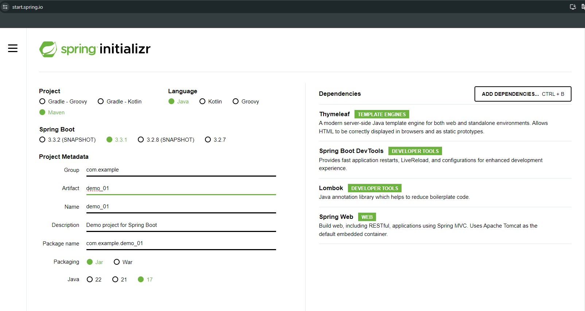
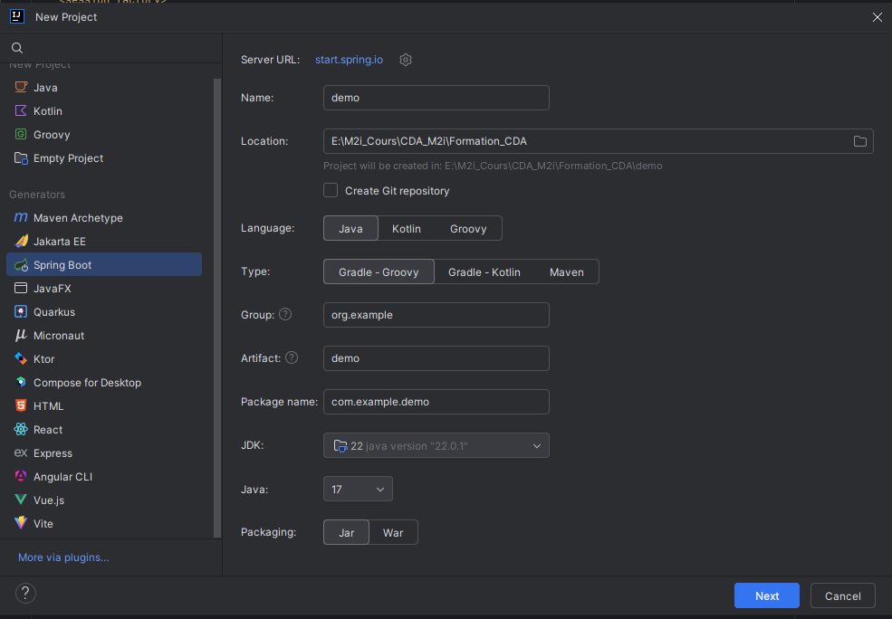
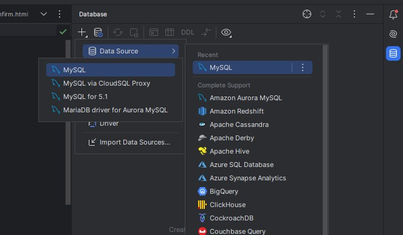
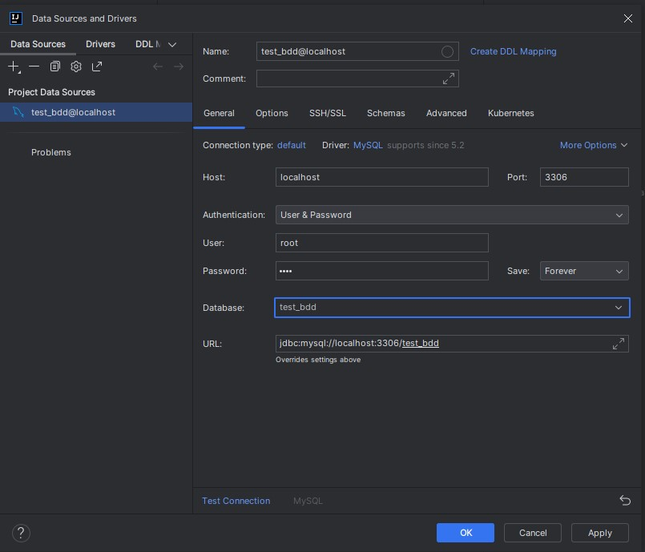
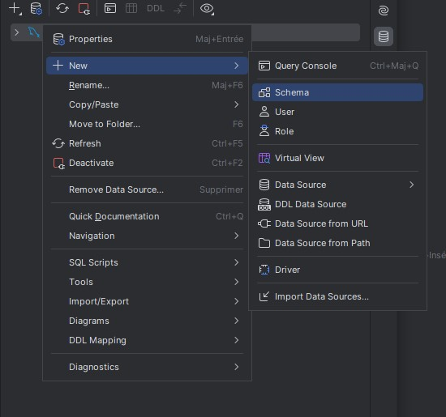

# Spring

## Nouveau projet

Pour génerer un nouveau projet, aller sur le site Spring initializr (https://start.spring.io/) et renseigner les informations nécessaires. 

Télécharger le projet en cliquant sur `Generate`.
Extraire le fichier zip, le mettre dans le dossier souhaité et ouvrir avec IntelliJ.

**Créer projet de base**


**Créer projet avec validation et BDD**


Spring va fonctionner avec l'injection de dépendances. 
Tout va fonctionner via des annotations.

---
On peut aussi initialiser le projet directement dans IntelliJ



Attention de bien sélectionner les dépendances. 

Cela n'est possible qu'avec la version Ultimate d'IntelliJ.

## Dépendances

### Beans

Classes que Spring va gérer lors de son fonctionnement.

### Pour la validation

```xml
<dependency>
    <groupId>org.springframework.boot</groupId>
    <artifactId>spring-boot-starter-validation</artifactId>
</dependency>
```

La dépendance `validation` permet de vérifier la validité des informations saisies par l'utilisateur dans le cadre d'un formulaire.

`Spring Boot Dev Tools` permet de recharger notre appli en temps réel et donc de ne pas avoir à la relancer sans cesse pour que les changements dans le code se mettent à jour.

`Lombok` permet de générer automatiquement les Getter et les Setter ainsi que nos constructeurs, des builders...

## Annotations
### @Autowired

L'annotation `@Autowired` dans Spring Framework est utilisée pour ***l'injection automatique de dépendances***. Elle permet à Spring de résoudre et d'injecter des beans collaborateurs dans votre bean. Voici les points clés de son fonctionnement :

- **Injection de dépendances** : @Autowired peut être utilisée sur les champs, les constructeurs ou les méthodes setter pour injecter automatiquement la dépendance requise.

- **Résolution par type** : Spring résout les dépendances par type. Si plus d'un bean du même type est présent dans le contexte de Spring, vous devrez utiliser des annotations supplémentaires comme @Qualifier pour spécifier lequel injecter.

- **Utilisation avec des champs** : Lorsqu'utilisée sur un champ, Spring injecte la dépendance directement dans le champ, en contournant le setter ou le constructeur.

- **Utilisation avec des constructeurs** : Lorsqu'utilisée sur un constructeur, @Autowired permet à Spring d'injecter les dépendances par le constructeur lors de la création du bean.

- **Utilisation avec des méthodes setter** : Lorsqu'utilisée sur une méthode setter, elle indique à Spring d'utiliser cette méthode pour injecter la dépendance.

- **Optionnelle** : Par défaut, toutes les injections @Autowired sont obligatoires, mais vous pouvez les rendre optionnelles en définissant l'attribut required à false.


/!\ Attention : L'Autowired n'est pas toujours recommandé car son comportement n'est pas toujours celui attendu.

### @BindingResult

L'annotation `@BindingResult` dans Spring MVC est utilisée pour ***capturer et stocker les résultats de la validation d'un objet ainsi que les erreurs qui peuvent survenir lors du processus de liaison*** (binding) des données de formulaire à un objet. Elle est typiquement utilisée après un objet annoté avec `@ModelAttribute` ou `@RequestBody` dans les méthodes de contrôleur pour vérifier les erreurs de liaison ou de validation.

Voici les points clés de son utilisation :

- **Capturer les erreurs** : @BindingResult doit suivre immédiatement le modèle (objet) que Spring tente de peupler. Cela permet à @BindingResult de capturer les erreurs qui se produisent pendant le processus de liaison.

- **Validation** : Lorsqu'utilisé avec `@Valid` ou `@Validated` sur l'objet modèle, @BindingResult capture les erreurs de validation définies par les annotations de validation sur l'objet modèle.

- **Contrôle des erreurs** : Dans le corps de la méthode, vous pouvez utiliser @BindingResult pour vérifier s'il y a des erreurs. Si des erreurs sont présentes, vous pouvez les gérer en conséquence, par exemple, en renvoyant l'utilisateur vers le formulaire avec les messages d'erreur.

- **Personnalisation de la réponse** : Permet de personnaliser la réponse envoyée à l'utilisateur en fonction des erreurs capturées, améliorant ainsi l'expérience utilisateur en fournissant des feedbacks spécifiques sur ce qui doit être corrigé.

### @Controller

En API va nous permettre de définir nos méthodes.
En web, on va y gérer l'affichage, avec Thymeleaf.

### @Primary

Si on a plusieurs implémentations d'une même interface, on peut définir quelle interface correspond à la configuration par défaut.

### @Configuration

On execute en priorité ce qu'il y a dedans. C'est exécuté avant le démarrage de l'application.


### @EnableWebSecurity

On active la sécurité dans notre application


## Validation

On peut mettre des annotations au dessus de nos attributs dans notre classe (dans les model)

Types d'annotations:
- @NotNull
    - on peut y ajouter un message si le champs est nul 
        - @NotNull(message = "merci de saisir le nom de votre chien")
- @NotBlank
- @Min(value = 1)
    - valable pour les int notamment. Ici on a défini que l'utilisateur ne doit pas entrer de valeur inférieure à 1.
- On peut mettre un message dans toutes nos annotations
    - @Min(value = 1, message = "merci de saisir une valeur positive")


## Intégrer base de données

Ajouter les dépendances correspondantes (voir visuel plus haut).

Créer une base de données reliée à MySQLWorkbench directement dans IntelliJ.
  
Renseigner les paramètres nécessaires
  
Ajouter un schéma pour relier à la base de données  
