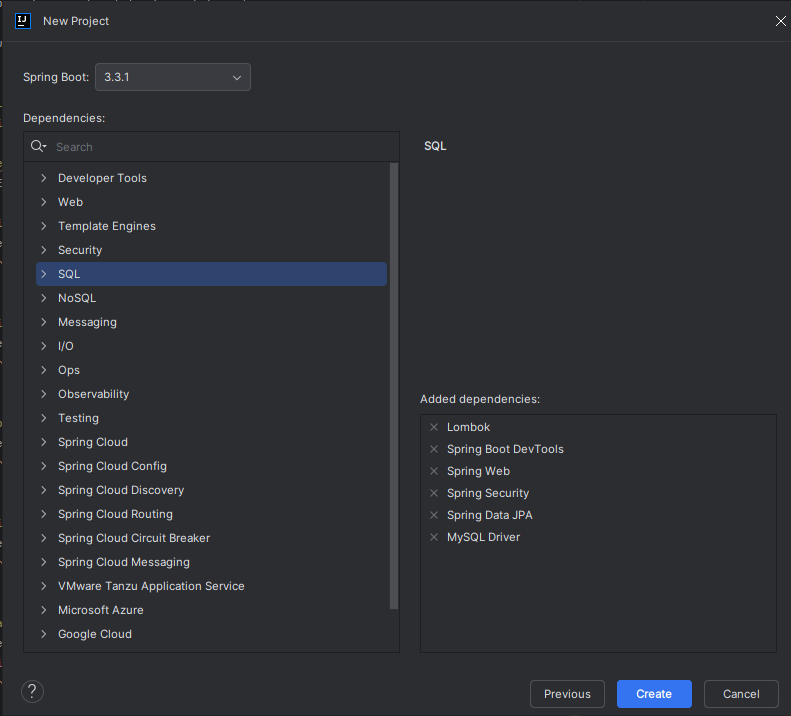
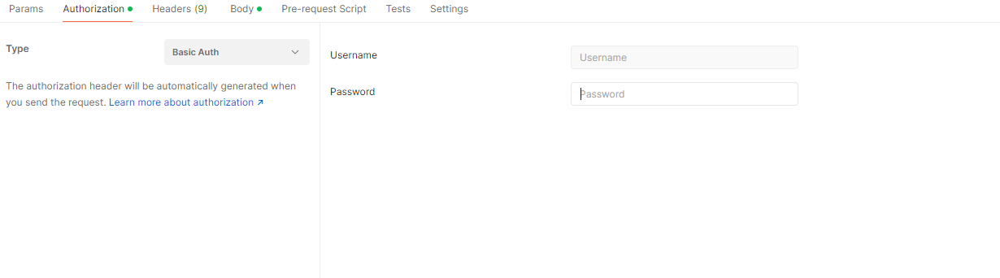

# Spring Security

## Bases

Framework très utilisé qu'on va coupler avec JWT.  
C'est un framework qui est extrêmement riche.

Spring Security peut s'ajouter à la fin du développement de l'application sans casser le code. 

Une fois mis en place, il bloque l'appli car il cherche une source de données.

### Sources de données
Il y a 3 façons de s'authentifier
- LDAP
- InMemory : l'information est directement dans l'application en dur. Fortement déconseillé car peu sécurisé.
- JDBC : l'information est stockée en base de données

> *Un serveur LDAP permet de centraliser l'authentification pour un utilisateur (on centralise l'authentification d'un utilisateur à plusieurs comptes/outils).*


-> **Authentification**: Vérification de l'identité d'une utilisateur  
-> **Autorisation**: Contrôle des accès en fonction des rôles et des permissions de l'utilisateur  
-> **Protection CSRF (Cross-Site Request Forgery)**: Prévention des attaques CSRF en incluant des jetons CSRF dans les requêtes (plutôt géré côté front et est généralement géré)  
-> **Sécurité des API REST**: Sécurisation des services REST avec des techniques telles que les jetons JWT  
-> **LDAP**: Intégration avec les serveurs LDAP pour l'authentification et l'autorisation  
-> **OAuth2**: Support pour OAuth2 pour les autorisations basées sur des jetons  
-> **Sécurité des sessions**: Gestion et protection des sessions utilisateur  
-> **Chiffrement**: Utilisation de mécanismes de chiffrement pour gérer les données sensibles


Pour une appli, si on prend une appli React qui veut récupérer des infos d'une API, la seule chose qui va s'échanger est un jeton qui sera récupéré, extrait et analysé par l'appli String. 


> **Sessionless**: A chaque fois qu'une personne voudra faire une requête auprès de l'application, il faudra un jeton. Autrement dit, toute communication avec l'application nécessite un jeton.

Spring Security est basé sur une série de filtres de servlet qui interceptent les requêtes entrantes et sortantes pour appliquer des règles de sécurité.

---

**Erreurs survenant couramment :** 
> **401** : pas authentifié. Les informations d'authentification ne sont pas les bonnes, l'appli ne sait pas qui on est.  
**403** : on est authentifié et l'appli sait qui on est, mais on a pas les bons droits pour faire telle ou telle action.

---

## Création d'un projet




## Configuration de Spring Security

Dans le fichier `application.properties` ou `application.yml`

```java
spring.application.name=spring-security-jwt
spring.datasource.url=jdbc:mysql://localhost:3306/springSecurityDemo?createDatabaseIfNotExist=true
spring.datasource.driver-class-name=com.mysql.cj.jdbc.Driver
spring.jpa.hibernate.ddl-auto=update
spring.datasource.username=root
spring.datasource.password=root
spring.security.user.name=admin
spring.security.user.password=12345
```


## Fonctionnement de Spring Security

https://docs.spring.io/spring-security/reference/servlet/architecture.html 


## Configuration par défaut

``` java
@Configuration //Exécuté avant le lancement de l'application
@EnableWebSecurity //Utilisé pour la sécurisation de l'application
public class SecurityConfig {

    @Bean //Important d'avoir un Bean avec SecurityFilterChain
    //Les annotations vont rendre réutilisable à différents endroits de mon application dans un même contexte
    //Permet de filtrer à différent niveaux des requêtes dans mon application
    public SecurityFilterChain filterChain(HttpSecurity http) throws Exception {
        http
            .csrf(Customizer.withDefaults()) //définit par défaut -> Va tout bloquer
            .authorizeHttpRequests(authorize -> authorize
                .anyRequest().authenticated() //Définit qu'il faut obligatoirement être authentifié pour accéder à mon application
            )
            .httpBasic(Customizer.withDefaults())
            .formLogin(Customizer.withDefaults());
        return http.build();
    }

}
```

A minima, il faut un mot de passe renforcé et chiffré (et donc qui ne soit pas en clair dans la base). 

Pour avoir un mot de passe renforcé, cela pourra passer par des validateurs avec des Regex sur le password.


## Authentification InMemory

```java
//Ce service sera utilisé pour apporter de l'authentification
    @Bean
    public UserDetailsService inMemoryUserDetailsService(){
        UserDetails user = User.withUsername("user") //UserDetails permet de récupérer des informations d'authentification. On récupère toujours un UserDetails //Récupérer User dans security.core.UserDetails
                .password(passwordEncoder().encode("password"))
                .roles("USER")
                .build();

        UserDetails user1 = User.withUsername("admin")
                .password(passwordEncoder().encode("admin"))
                .roles("ADMIN")
                .build();

        return new InMemoryUserDetailsManager(user, user1); //Ici on a l'implémentation de l'interface UserDetails
    }
```

Dans Postman :




## 3 étapes importantes

Essayer de les développer dans l'ordre et de les tester au fur et à mesure.

-> Register  
-> Login (génération du JWT)
-> Communication (le JWT va servir à communiquer avec l'application à chaque requête. Il faut également vérifier si le token est valide à chaque fois qu'on intercepte une requête)


## Convention de nommage pour les rôles

`Role_Admin`
`Role_User`


### JWT

Génère un jeton qui est:
- Unique
- Facilement vérifiable 
- Peut contenir des informations dans le payload

https://jwt.io/

Il y a 3 dépendances pour utiliser JWT

```xml
       <dependency>
            <groupId>io.jsonwebtoken</groupId>
            <artifactId>jjwt-api</artifactId>
            <version>0.11.2</version>
        </dependency>
        <dependency>
            <groupId>io.jsonwebtoken</groupId>
            <artifactId>jjwt-impl</artifactId>
            <version>0.11.2</version>
            <scope>runtime</scope>
        </dependency>
        <dependency>
            <groupId>io.jsonwebtoken</groupId>
            <artifactId>jjwt-jackson</artifactId>
            <version>0.11.2</version>
            <scope>runtime</scope>
        </dependency>
```


Un Token est composé de:
- un header (peut passer des cookies, le jeton, le content-Type...)
- un payload (comprend de la data)
- un secret


Dans le SpringSecurityJwtApplication, ajouter les lignes ci-dessous pour générer une clé secrète

```java
        SecretKey key = Keys.secretKeyFor(SignatureAlgorithm.HS512);

        String base64Key = Encoders.BASE64.encode(key.getEncoded());

        System.out.println(base64Key);
```