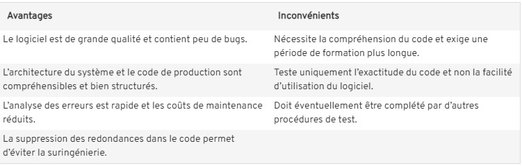

# Test Driven Development (TDD)

Le test-driven development s'effectue par cycle de trois phases : 
- red (rouge)
- green (vert)
- refactor (remaniement)

L'intérêt du TDD est d'explorer le besoin, de le préciser et de spécifier le comportement du logiciel voulu selon son utilisation, et ce, avant chaque étape du codage. Ainsi, le logiciel produit est pensé pour répondre précisément au besoin et est conçu pour le faire avec simplicité.

Écrire les tests en amont du code permettent de guider de corriger un problème en guidant le codage à chaque étape. Cela permet aussi de documenter le comportement du logiciel et d'obtenir un filet de sécurité contre les régressions.

## Etapes du TDD

1. **Écrire un test unitaire qui échoue**  
La première étape de la méthode du test-driven development consiste à développer un test qui échoue volontairement. L'échec est normal, puisque les développeurs ont créé des tests compacts basés sur des hypothèses. Autrement dit, comme le code à tester n'a pas encore été créé, le test va forcément conduire à l'échec. Le test unitaire est donc symbolisé par la phase rouge.

2. **Réécrire le code pour réussir le test**  
L'idée de cette seconde étape est de passer le test avec le minimum de code et le minimum d'effort pour répondre au besoin. Pour cela, l'équipe de développement doit apporter les modifications minimales nécessaires pour corriger le code afin qu'il s'exécute correctement. Le test va donc devenir un succès et passer au vert.

3. **Remanier le code**  
La dernière étape, celle du refactoring, permet de remanier le code pour contrôler que tous les tests réalisés restent bien en vert.  
Dans cette phase de cycle, l'équipe de développement a besoin de structurer et de potentiellement compléter le code de production afin qu'il soit propre et lisible.  
Afin d'être le plus efficace possible, il est conseillé d'adopter le point de vue d'une tierce personne découvrant le code et se demander s'il est suffisamment compréhensible pour elle.

## Avantages et inconvénients

---

### Tutos pour s'entrainer

[TutoGrafikart](https://grafikart.fr/tutoriels/tdd-pratique-javascript-1205)