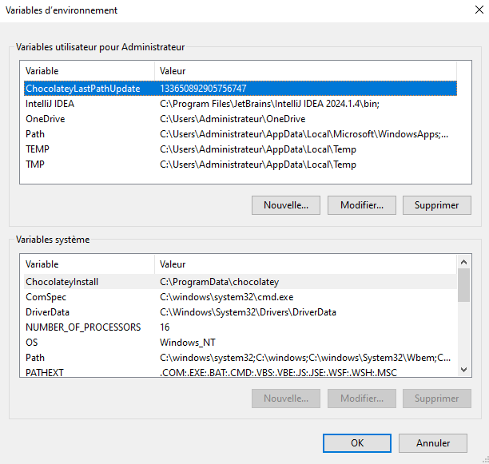
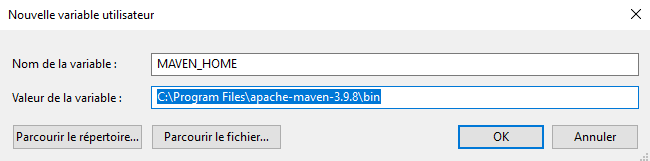
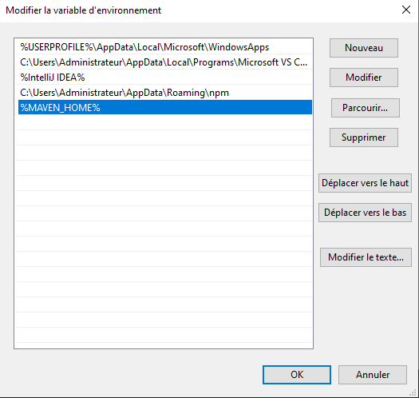
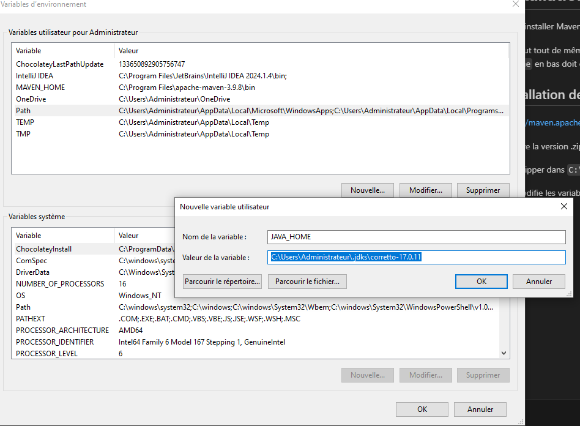
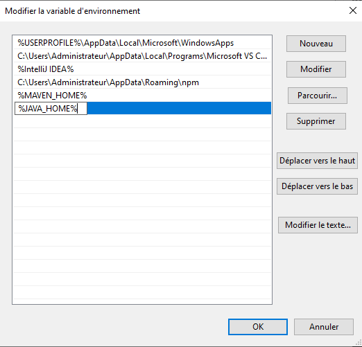
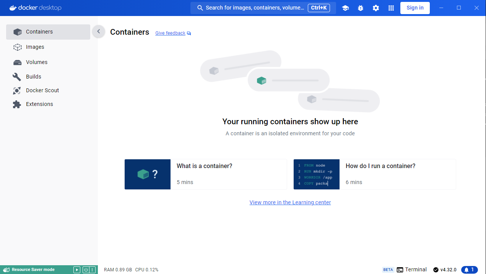

# Installation

Il faut installer Maven pour pouvoir utiliser docker.

On peut tout de même lancer l'installation sans avoir maven.
Si docker est correctement installé, l'encart `Engine` en bas doit être vert


## Installation de Maven

https://maven.apache.org/download.cgi

Prendre la version .zip 3.9.8

Le dezipper dans `C:\Program Files`

On modifie les variables d'environnement (pour votre compte, pas système)

Créer une nouvelle variable d'environnement :




Modifier la variable path  



Si Java Home n'est pas présent, il faut également installer la variable d'environnement


Modifier la variable path  


On vérifie dans un terminal que Maven est bien installé avec la commande:
```powershell
mvn --v
```

Pour vérifier que Docker tourne, on rentre la commande
```powershell
docker ps
```


Interface Docker 




## SonarQube

Par défaut, le mot de passe dans localhost est admin